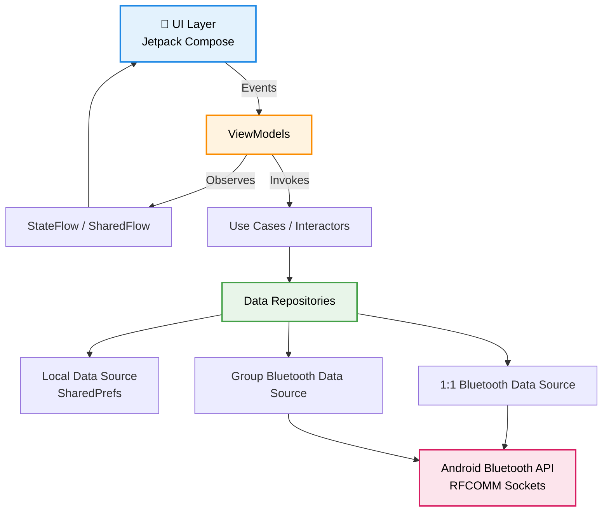
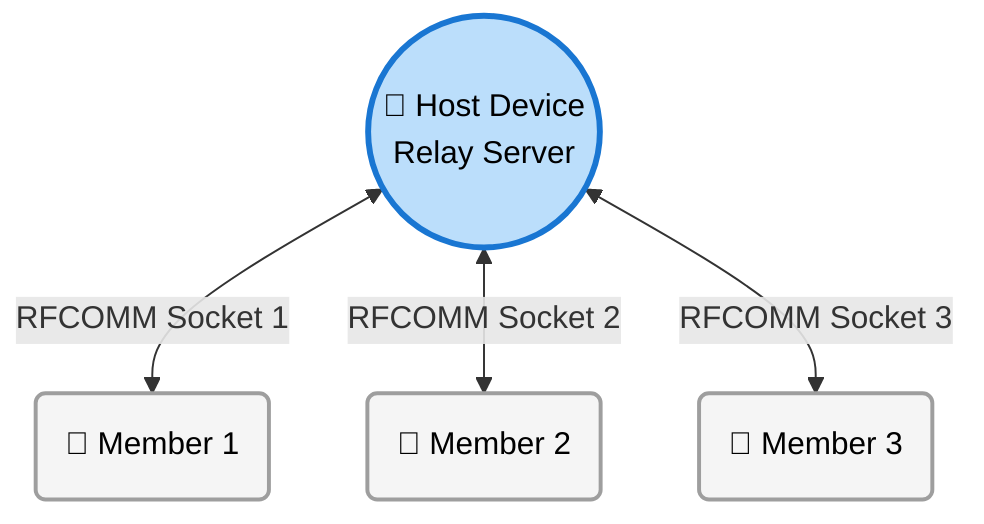
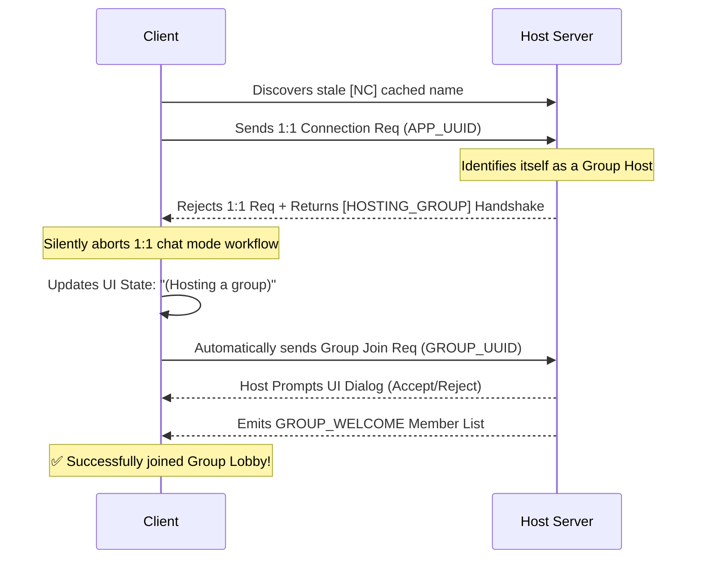
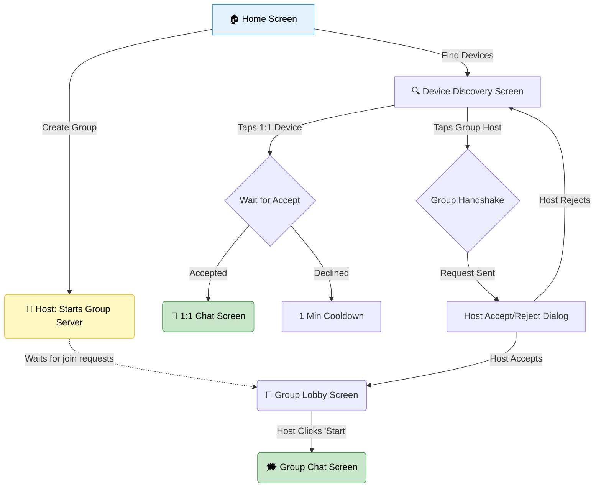

<div align="center">
  <h1>NearChat</h1>
  <p><strong>A fast, completely offline, decentralized chat application for Android powered by Bluetooth Classic (RFCOMM).</strong></p>

  <p>
    
    
    
  </p>
</div>

<br/>

**NearChat** enables seamless peer-to-peer and group messaging without the need for Wi-Fi or cellular networks. Built with modern Android development practices, it is designed to be highly reliable, securely managing complex socket lifecycles, robust connection handshakes, and strict host-member permission flows.

---

## Table of Contents
- [Key Features](#-key-features)
- [Tech Stack & Architecture](#️-tech-stack--architecture)
- [System Design & Core Mechanisms](#-system-design--core-mechanisms)
  - [Group Chat Setup: Star Topology](#1-group-chat-setup-star-topology)
  - [Dynamic Handshake & OS Caching Fallback](#2-dynamic-handshake--os-caching-fallback)
- [User Flow & Navigation](#-user-flow--navigation)
- [Screenshots](#-screenshots)
- [Technical Challenges Solved](#-technical-challenges-solved)
- [Getting Started](#-getting-started)

---

## Key Features

- **Completely Decentralized:** Chat freely anywhere you go—no internet, Wi-Fi, or cellular network required.
- **1:1 Peer-to-Peer Chat:** Instantly discover nearby devices and establish secure, bi-directional RFCOMM sockets.
- **Group Chat (Star Topology):** Host local group chats where the Host acts as a central relay, seamlessly broadcasting messages to all connected members simultaneously.
- **Permission-Based Lobbies:** Group hosts maintain full control over their lobbies, featuring real-time Accept/Decline dialogs for incoming connection requests.
- **Robust Socket Lifecycle Management:** Prevents memory leaks and zombie sockets when navigating across screens, backgrounding the app, or abruptly disconnecting.
- **Dynamic Handshake Protocol:** Automatically resolves Android's aggressive Bluetooth name caching by silently intercepting and redirecting outdated connection attempts.

---

## Tech Stack & Architecture

NearChat is built utilizing **Clean Architecture** principles and the **MVVM** pattern to ensure separation of concerns, testability, and a highly responsive UI.

- **Language:** Kotlin
- **UI Framework:** Jetpack Compose (Declarative UI)
- **Asynchronous Programming:** Kotlin Coroutines & `StateFlow` / `SharedFlow`
- **Dependency Injection:** Dagger Hilt
- **Hardware Integration:** Android OS `BluetoothAdapter`, `BluetoothServerSocket`, `BluetoothSocket`

### Architecture Overview



---

## System Design & Core Mechanisms

### 1. Group Chat Setup: Star Topology

Due to the hardware limitations of Bluetooth Classic, establishing a true decentralized, device-to-device mesh network is highly restrictive uniformly across all Android devices. NearChat circumvents this by implementing a **Star Topology** for group communications.



*Mechanism: When Member 1 sends a message, it is transmitted directly to the Host. The Host instantly acts as a relay, broadcasting that message to Member 2 and Member 3 in real-time. This maintains strict synchronization and message ordering across the entire group without requiring members to connect to each other.*

### 2. Dynamic Handshake & OS Caching Fallback

**The Problem:** Android OS aggressively caches Bluetooth device names to preserve battery life. If `User A` alters their broadcast state from `[NC]` (1:1 mode) to `[NC-G]` (Group Host mode), `User C`'s device might still view them as `[NC]` due to the stale cache. 

**The Solution:** NearChat implements a highly resilient, under-the-hood handshake to intercept these cache-miss connection attempts. The application seamlessly negotiates the connection type and redirects the user into the appropriate group lobby without dropping the connection or exposing the error to the user interface.



---

## User Flow & Navigation

The flowchart below visualizes how users interact and navigate through NearChat's 1:1 and Group Chat ecosystems, demonstrating the lifecycle and decision points.



---

## Screenshots


---

## Technical Challenges Solved

Building a reliable Bluetooth application involves navigating severe hardware and OS-level constraints. Here is how NearChat handles them:

1. **Zombie Sockets & Memory Leaks:** 
   Bluetooth sockets operate outside the standard Android component lifecycle. NearChat utilizes careful Coroutine scoping and `ViewModel` `onCleared()` overrides to ensure that sockets are safely closed and input/output streams are flushed whenever a user backgrounds the app or loses connection, preventing "address in use" errors on subsequent connections.
2. **Concurrency & Thread Safety:**
   Handling asynchronous byte streams from multiple devices (in a group chat) requires thread synchronization. NearChat uses Kotlin `SharedFlow` to act as an event bus, safely marshaling network callbacks onto the main thread for UI rendering without race conditions.
3. **OS-Level Caching Overrides:**
   Addressed the Android Bluetooth name caching limitation by implementing custom RFCOMM handshake payloads (as detailed in the System Design section).

---

## Getting Started

### Prerequisites
- **Android Studio:** Ladybug or newer.
- **Physical Android Device:** Emulators **do not** properly support Bluetooth RFCOMM hardware discovery.
- Bluetooth must be enabled on the testing devices.
- Permissions requirement:
  - `ACCESS_COARSE_LOCATION` & `ACCESS_FINE_LOCATION` (Required by Android 11 and below for Bluetooth scanning).
  - `BLUETOOTH_SCAN` & `BLUETOOTH_CONNECT` (Utilized for Android 12+).

### Installation
1. Clone the repository:
   ```bash
   git clone https://github.com/yourusername/NearChat.git
   ```
2. Open the project in Android Studio.
3. Build and run the app simultaneously on **at least two physical Android devices**.
4. Allow all permission prompts to enable Bluetooth discovery and start chatting!

---

## Contributing
Contributions, issues, and feature requests are welcome! 
Feel free to check the [issues page](https://github.com/yourusername/NearChat/issues).

<div align="center">
  <p>Built with ❤️ by an Android Developer</p>
</div>
