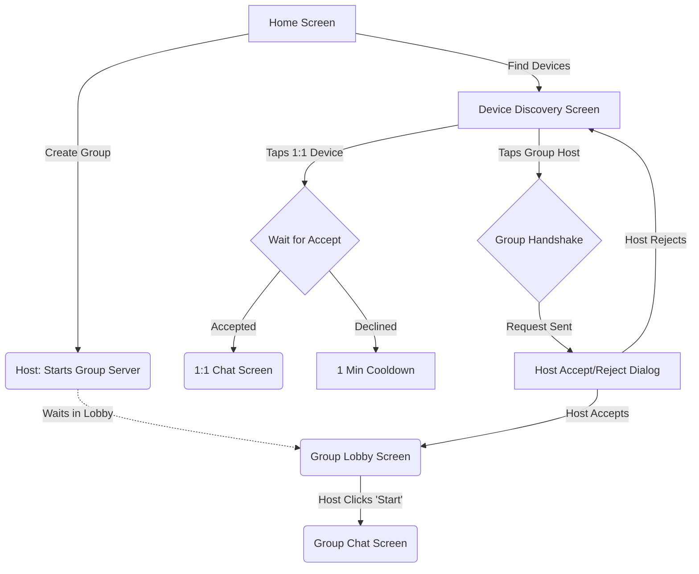
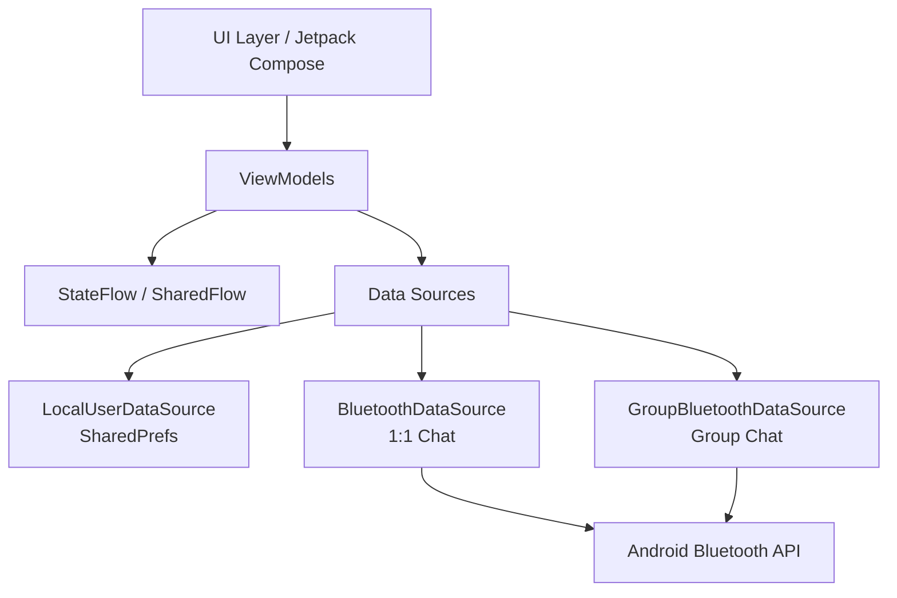
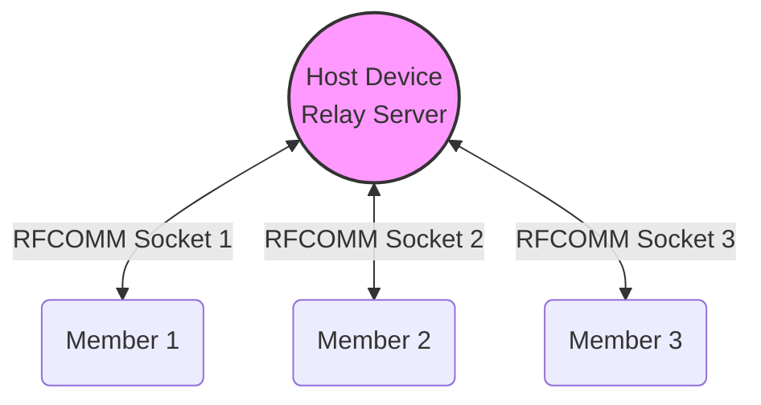
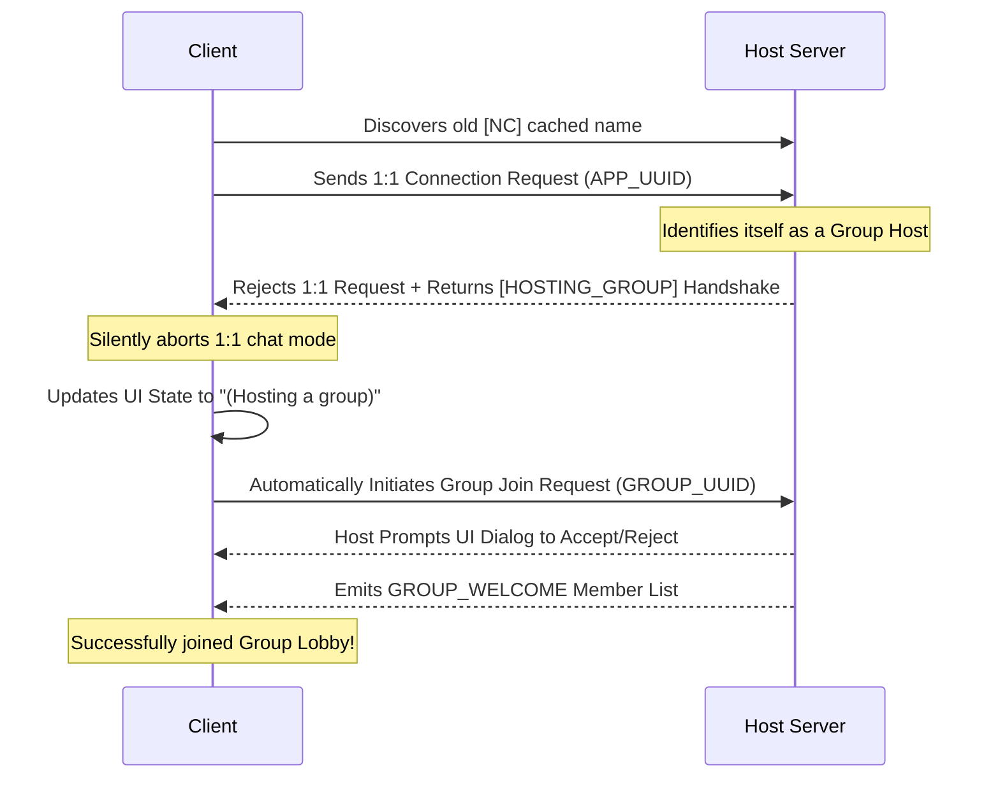

# NearChat 📱⚡️

**NearChat** is a fast, completely offline, decentralized chat application for Android that uses **Bluetooth Classic (RFCOMM)** to enable seamless peer-to-peer and group messaging. 

Built with modern Android development practices, NearChat is designed to be highly reliable, securely managing socket lifecycles, robust connection handshakes, and strict host-member permission flows.

---

## 🚀 Features

- **Decentralized Messaging:** Chat freely without Wi-Fi or cellular networks anywhere you go.
- **1:1 Peer-to-Peer Chat:** Instantly discover nearby devices and establish secure two-way RFCOMM sockets.
- **Group Chat (Star Topology):** Host a local group chat where the Host acts as a central relay, broadcasting messages to all connected members simultaneously.
- **Permission-based Joining:** Group hosts have full control over their lobbies, with real-time Accept/Decline dialogs for incoming members.
- **Robust Socket Lifecycle Management:** Prevents memory leaks and zombie sockets when navigating across screens or abruptly disconnecting.
- **Dynamic Handshake Protocol:** Automatically handles Android's aggressive Bluetooth name caching by silently intercepting and redirecting outdated connection attempts to the correct socket.

---

## 📸 Screenshots

---

## 🗺️ User Flow & Navigation

The flowchart below visualizes how users interact and navigate through NearChat's 1:1 and Group Chat ecosystems:

---

## 🛠 Tech Stack & Architecture

- **Language:** Kotlin
- **UI:** Jetpack Compose (Declarative UI)
- **Asynchrony:** Coroutines & StateFlow / SharedFlow
- **Dependency Injection:** Dagger Hilt
- **Architecture:** MVVM (Model-View-ViewModel) + Clean Architecture principles
- **Hardware API:** Android OS `BluetoothAdapter`, `BluetoothServerSocket`, `BluetoothSocket`

### Architecture Overview

---

## 📡 Group Chat Setup: Star Topology

Due to the hardware limitations of Bluetooth Classic, true decentralized mesh networks are difficult to enforce uniformly across Android devices. NearChat solves this by establishing a **Star Topology** for group chats.

*When Member 1 sends a message, it is transmitted directly to the Host. The Host then immediately broadcasts that message to Member 2 and Member 3 in real-time, maintaining strict synchronization and ordering across the group.*

---

## 🔄 Dynamic Handshake & OS Caching Fallback

Android OS aggressively caches Bluetooth device names to save battery. If `User A` changes their broadcast name from `[NC]` (1:1 mode) to `[NC-G]` (Group Host mode), `User C`'s device might still rely on the outdated cached name. 

NearChat implements a highly resilient hidden handshake to intercept these cache-miss connection attempts. The app seamlessly redirects the connection into a group lobby without dropping the workflow or confusing the user.

---

## 🏃 Getting Started

### Prerequisites
- Android Studio Ladybug or newer.
- **Physical Android Device:** (Emulators do not properly support Bluetooth RFCOMM hardware discovery). 
- Bluetooth must be enabled on the testing devices.
- `ACCESS_COARSE_LOCATION` & `ACCESS_FINE_LOCATION` permissions must be granted (required by Android 11 and below for Bluetooth scanning).
- `BLUETOOTH_SCAN` & `BLUETOOTH_CONNECT` permissions are utilized for Android 12+.

### Installation
1. Clone the repository: `git clone https://github.com/yourusername/NearChat.git`
2. Open the project in Android Studio.
3. Build and run the app simultaneously on **at least two physical Android devices**.
4. Allow all permission prompts and start chatting!

---

## 🤝 Contributing
Contributions, issues, and feature requests are welcome! 
Feel free to check the [issues page](https://github.com/yourusername/NearChat/issues).
